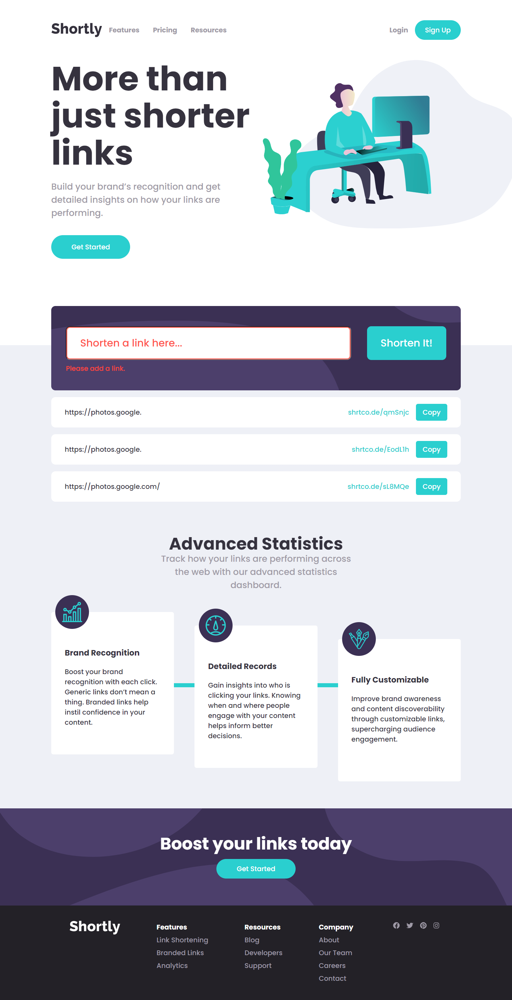

# Frontend Mentor - Shortly URL shortening API Challenge solution

This is a solution to the [Shortly URL shortening API Challenge challenge on Frontend Mentor](https://www.frontendmentor.io/challenges/url-shortening-api-landing-page-2ce3ob-G). Frontend Mentor challenges help you improve your coding skills by building realistic projects.

## Table of contents

- [Overview](#overview)
  - [The challenge](#the-challenge)
  - [Screenshot](#screenshot)
  - [Links](#links)
- [My process](#my-process)
  - [Built with](#built-with)
  - [What I learned](#what-i-learned)
  - [Some code snippets I am particularly proud of](#some-code-snippets-i-am-particularly-proud-of)
  - [Useful resources](#useful-resources)
- [Author](#author)

## Overview

### The challenge

Users should be able to:

- View the optimal layout for the site depending on their device's screen size
- Shorten any valid URL
- See a list of their shortened links, even after refreshing the browser
- Copy the shortened link to their clipboard in a single click
- Receive an error message when the `form` is submitted if:
  - The `input` field is empty

### Screenshot




### Links

- Solution URL: [Frontend Mentor](https://your-solution-url.com)
- Live Site URL: [Vercel](https://your-live-site-url.com)

## My process

### Built with

- Semantic HTML5 markup
- CSS custom properties
- Flexbox
- [React](https://reactjs.org/) - JS library
- [Styled Components](https://styled-components.com/) - For styles
- [Axios](https://www.npmjs.com/package/axios) - For HTTP requests
- [React Font Awesome](https://fontawesome.com/v5.15/how-to-use/on-the-web/using-with/react) - For footer icons
- [React Loader Spinner](https://www.npmjs.com/package/react-loader-spinner) - For loading animation

### What I learned

After trying Redux for my last Frontend Mentor Challenge, this time I decided to practise with the UseContext hook.

The challenge also required me to work with local storage, which was something I had never done before in any non-tutorial project.

### Some code snippets I am particularly proud of


I managed to change the text inside a button on click with CSS only.
```css
& button:focus {
    background-color: hsl(257, 27%, 26%);
    color: white;
    cursor: default;
    &::after {
      content: "Copied!";
    }
  }
```
I parsed the content of the local storage, then I mapped through it.
```js
 {ctx.data.map((storageItem) => {
        return (
          <StyledShortenedLink key={localStorage.getItem(storageItem)}>
            <div>
              <span className="shortened-first">
                {JSON.parse(localStorage.getItem(storageItem))[0]}
              </span>
            </div>
            <span className="shortened-second">
              {JSON.parse(localStorage.getItem(storageItem))[1]}
              <button
                onClick={() =>
                  navigator.clipboard.writeText(
                    JSON.parse(localStorage.getItem(storageItem))[1]
                  )
                }
              />
            </span>
          </StyledShortenedLink>
        );
      })}
};
```

### Useful resources

- [Stack Overflow - How to copy text to clipboard](https://stackoverflow.com/questions/39501289/in-reactjs-how-to-copy-text-to-clipboard)

## Author

- Frontend Mentor - [@yourusername](https://www.frontendmentor.io/profile/alessioitalo)
- Twitter - [@yourusername](https://www.twitter.com/alessioitalo)